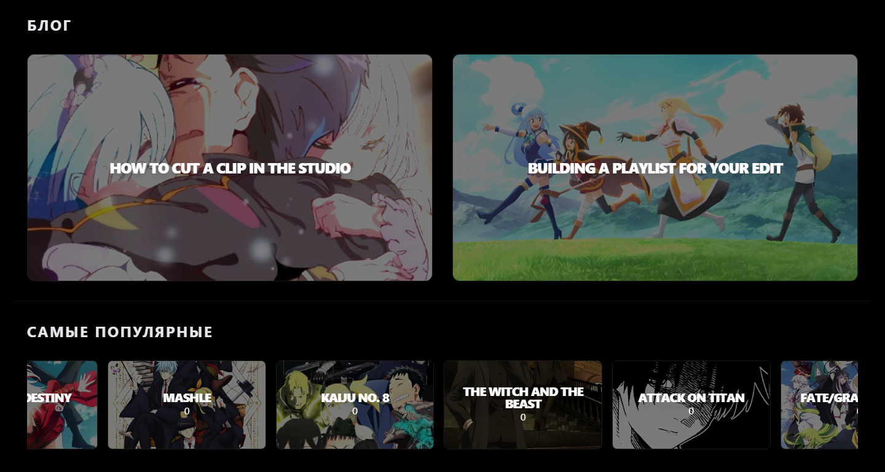
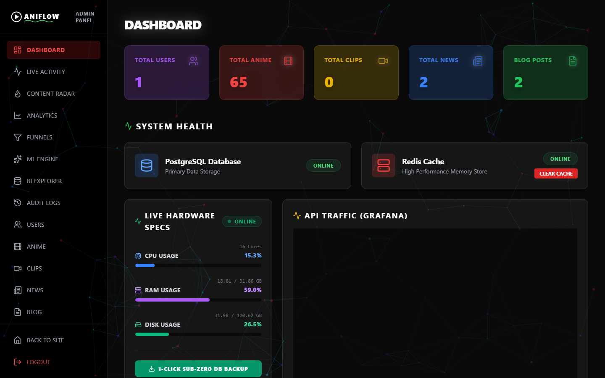

# AniFlow

Каталог аниме с сериями и короткими клипами для фан-эдитов. Клип можно обрезать прямо на сайте, сделать из него GIF или вертикальное видео и скачать; админ видит зрителей в реальном времени на 3D-глобусе. Бэкенд на FastAPI, фронтенд на React 19.

[](LICENSE)
[](https://github.com/tgKishikaisei/MyAnimeApp/actions/workflows/ci.yml)





## Возможности

- **Каталог.** Аниме, сезоны, серии и клипы с тегами; поиск, «Active Packs» с онгоингами сезона.
- **Студия.** FFmpeg на сервере режет фрагмент, собирает GIF и вертикальное видео, вытаскивает звук и накладывает аудиопресет. Одновременных рендеров не больше заданного лимита.
- **Скачивание.** Один клип или ZIP по сезону и серии через подписанные ссылки, которые живут 10 минут.
- **Аккаунт.** Комментарии и отзывы, плейлисты, список «смотреть позже», уведомления через WebSocket.
- **Админка.** Живая лента событий, глобус на three.js, менеджер аниме с drag-and-drop, выгрузка данных, журнал действий, который приложение не может переписать.
- **Интерфейс.** Английский, русский и японский; PWA с офлайн-страницей; анимации отключаются при системной настройке «уменьшить движение».

## Стек

| Часть | Что используется |
|---|---|
| Бэкенд | Python 3.12, FastAPI, SQLAlchemy 2 (async), Alembic, PyJWT, pwdlib (Argon2), slowapi |
| Данные | PostgreSQL 17, Redis 7.4 |
| Фронтенд | React 19, TypeScript, Vite 7, Tailwind CSS, framer-motion, i18next, TipTap, dnd-kit, three.js |
| Инфраструктура | Docker Compose, nginx, Prometheus и Grafana (по желанию), Sentry (по желанию) |
| Проверки | pytest на PostgreSQL, Vitest, ESLint, Ruff, bandit, pip-audit, npm audit, Trivy, gitleaks |

## Запуск через Docker

```bash
git clone https://github.com/tgKishikaisei/MyAnimeApp.git
cd MyAnimeApp
cp .env.example .env        # впишите SECRET_KEY, POSTGRES_PASSWORD, REDIS_PASSWORD
docker compose up -d --build
```

Бэкенд сам применяет миграции при старте. Сайт откроется на http://localhost:8080.

Админа через API создать нельзя, только скриптом:

```bash
docker compose exec backend python -m scripts.admin.create_admin --email you@example.com --username you
```

Мониторинг подключается вторым файлом:

```bash
docker compose -f docker-compose.yml -f docker-compose.monitoring.yml up -d
```

## Разработка без Docker

Бэкенду нужны PostgreSQL и Redis.

```bash
cd backend
python -m venv venv
venv\Scripts\activate                 # Linux и macOS: source venv/bin/activate
pip install --require-hashes -r requirements.txt -r requirements-dev.txt
cp .env.example .env                   # ENV=development и адрес своей базы
alembic upgrade head
uvicorn app.main:app --reload
```

```bash
cd frontend
npm ci
npm run dev                            # Vite проксирует /api и /static на :8000
```

## Тесты

Тестам бэкенда нужна пустая база PostgreSQL. Проще всего поднять её контейнером:

```bash
docker run -d --name aniflow-test -p 55432:5432 -e POSTGRES_USER=aniflow -e POSTGRES_PASSWORD=aniflow_test_pw -e POSTGRES_DB=aniflow_test postgres:17-alpine
cd backend && python -m pytest -q
cd ../frontend && npm test
```

## Живая версия

Публичного стенда нет, проект запускается локально.

## Лицензия

Код: [MIT](LICENSE) © 2026 Behruz Avezmatov. Кадры, постеры и названия аниме принадлежат их студиям и правообладателям.
